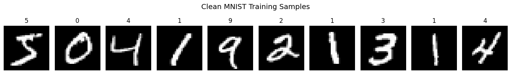
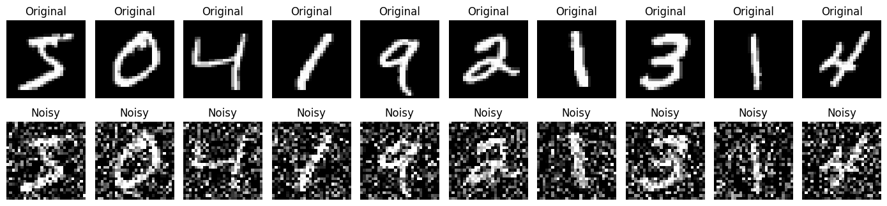

# 🖼️ Denoising Autoencoder using MNIST

A deep learning project that demonstrates how a **Convolutional Denoising Autoencoder** can remove Gaussian noise from handwritten digit images using the **MNIST dataset**. The model learns meaningful image representations through an encoder–decoder architecture and reconstructs clean images from noisy inputs.

---

# 📖 Project Overview

Image noise is a common problem caused by camera sensors, poor lighting, image compression, or transmission errors. The goal of this project is to train a neural network that can recover clean handwritten digit images from noisy versions while preserving the original digit structure.

The project follows a complete deep learning workflow, including data preprocessing, artificial noise generation, model development, training, evaluation, and visualization of reconstructed images.

---

# 🎯 Project Objectives

* Build a Convolutional Denoising Autoencoder for image reconstruction.
* Load and preprocess the MNIST handwritten digit dataset.
* Generate noisy images using Gaussian noise.
* Train the model with noisy images as input and clean images as target outputs.
* Reconstruct denoised images from the noisy test dataset.
* Evaluate the reconstruction quality through visual comparisons and PSNR.

---

# ⚙️ Project Workflow

```text
MNIST Dataset
      │
      ▼
Data Preprocessing
(Normalization & Reshaping)
      │
      ▼
Gaussian Noise Generation
      │
      ▼
Noisy Images
      │
      ▼
Encoder
(Feature Extraction)
      │
      ▼
Latent Space
(Bottleneck)
      │
      ▼
Decoder
(Image Reconstruction)
      │
      ▼
Denoised Output Images
      │
      ▼
Performance Evaluation
```

---

# 🧠 Model Architecture

The project uses a **Convolutional Autoencoder** consisting of:

### Encoder

* Conv2D Layers
* Batch Normalization
* ReLU Activation
* MaxPooling2D

### Bottleneck

* Compressed latent representation that captures the important features of the handwritten digit while filtering unnecessary information.

### Decoder

* UpSampling2D
* Conv2D Layers
* Batch Normalization
* Sigmoid Output Layer

This encoder–decoder architecture enables the model to reconstruct clean images while effectively removing noise.

---

# 📂 Dataset Information

Dataset: **MNIST Handwritten Digits**

* 60,000 Training Images
* 10,000 Testing Images
* Image Size: 28 × 28 pixels
* Grayscale Images
* 10 Digit Classes (0–9)

### Dataset Samples

<p align="center">
  
</p>

---

# 🧪 Noisy Input Images

Gaussian noise is added to the original MNIST images to generate noisy inputs for training the denoising autoencoder. The model learns to reconstruct clean images from these noisy samples.

<p align="center">
  
</p>

---

# 🛠️ Technologies Used

* Python
* TensorFlow / Keras
* NumPy
* Matplotlib
* Jupyter Notebook

---

# 📊 Model Training

The model was trained using:

* **Optimizer:** Adam
* **Loss Function:** Mean Squared Error (MSE)
* **Callbacks:** EarlyStopping and ReduceLROnPlateau
* **Input:** Noisy MNIST Images
* **Target:** Original Clean MNIST Images

### Training & Validation Loss

The graph below shows the training and validation loss during model training. A steady decrease in both losses indicates that the model successfully learns to reconstruct clean images from noisy inputs.

<p align="center">
  
</p>

---

# 📈 Results

The trained model learns to reconstruct clean handwritten digits by removing Gaussian noise from the input images. Performance is evaluated using:

* Side-by-side comparison of **Original**, **Noisy**, and **Reconstructed** images.
* Peak Signal-to-Noise Ratio (**PSNR**) for measuring reconstruction quality.
* Training and validation loss curves to monitor model convergence.

### Reconstruction Results

<p align="center">
  
</p>

---

# 💡 Key Learnings

* Understood the working of Denoising Autoencoders.
* Learned image preprocessing and Gaussian noise generation.
* Implemented a CNN-based Encoder–Decoder architecture.
* Gained experience in image reconstruction using deep learning.
* Evaluated image quality using PSNR and visual comparisons.

---

# 🚀 Future Improvements

* Experiment with different noise levels.
* Compare multiple autoencoder architectures.
* Evaluate using SSIM alongside PSNR.
* Train on custom handwritten digit datasets.
* Extend the model for real-world image restoration tasks.

---

# 📁 Repository Structure

```text
.
├── assets/
│   ├── input1.png
│   ├── noisyimage.png
│   ├── training and validation.png
│   └── final output.png
├── week6.ipynb
└── README.md
```

---

# 🎓 Conclusion

This project demonstrates the complete implementation of a **Convolutional Denoising Autoencoder** for image denoising using the MNIST dataset. It highlights the effectiveness of encoder–decoder networks in learning compact feature representations and reconstructing clean images from noisy inputs. The project provides a strong foundation for advanced computer vision tasks such as image restoration, medical image enhancement, document cleanup, and generative deep learning.
# 👨‍💻 Author
Kamlesh Deora B.Tech CSE (AI & ML) Celebal Technologies – Data Science Internship (Week 6)
