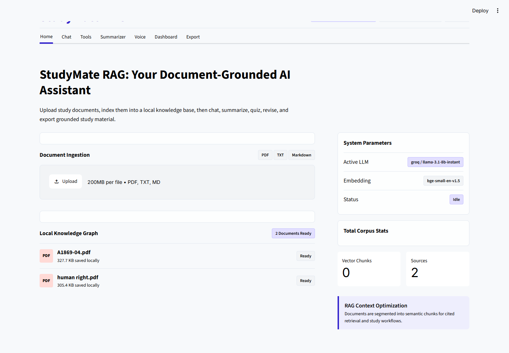
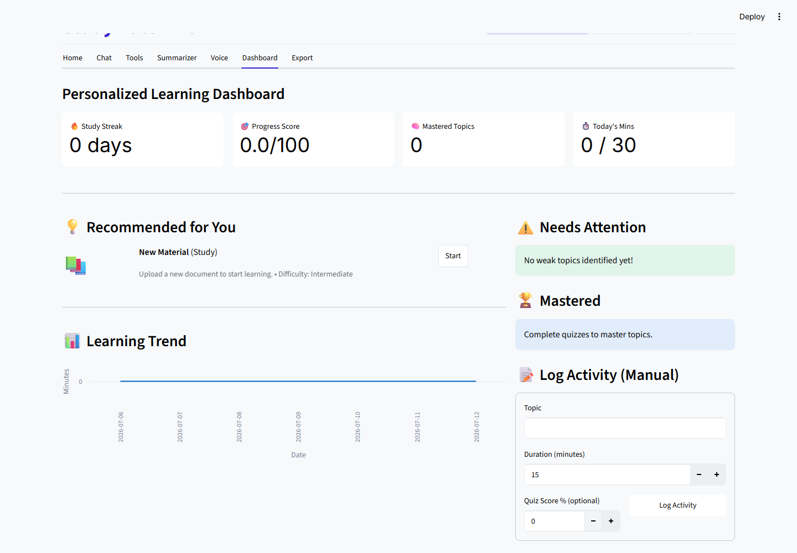
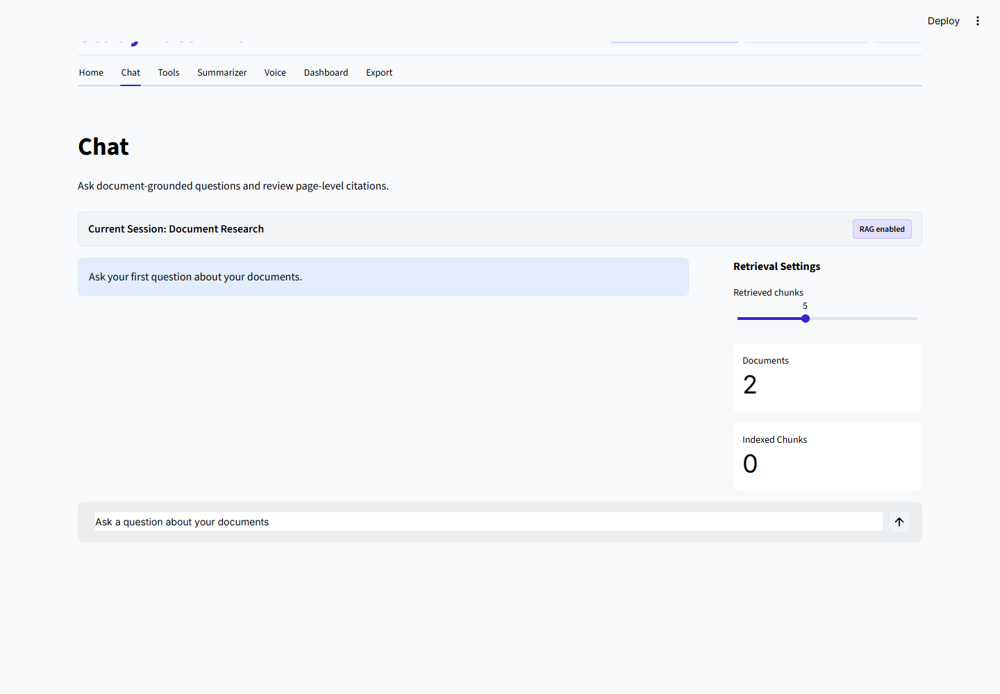
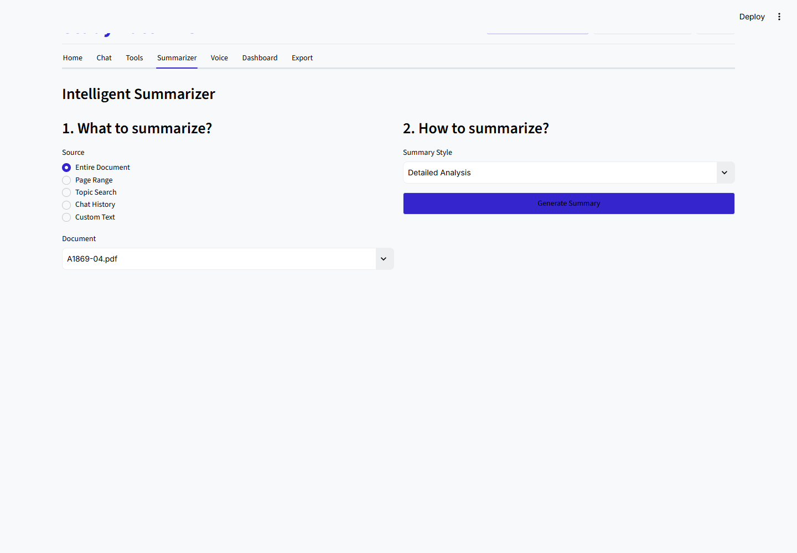
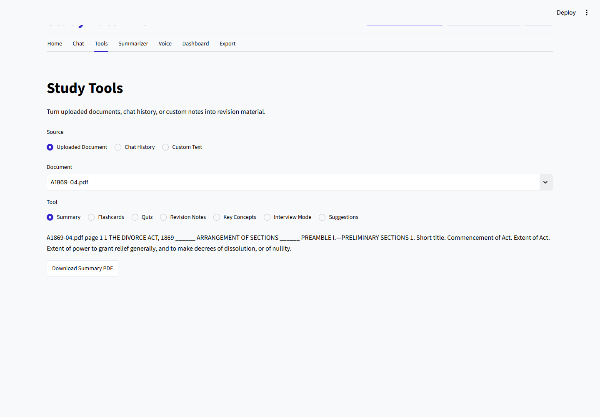

# 🎓 StudyMate RAG – AI-Powered Study Assistant

<div align="center">


### 🚀 Enterprise AI-Powered Study Assistant using Retrieval-Augmented Generation (RAG)

*Developed as the Final Project for the Celebal Technologies Excellence Internship.*

</div>

---

# 📖 Project Overview

**StudyMate RAG** is an intelligent AI-powered learning assistant designed to help students study more efficiently using **Retrieval-Augmented Generation (RAG)**.

Instead of relying only on a Large Language Model, the application first retrieves the most relevant information from uploaded study materials and then generates context-aware answers. This significantly improves answer accuracy while reducing hallucinations.

The platform enables students to upload multiple documents, ask questions in natural language, generate summaries, quizzes, flashcards, revision notes, key concepts, interview questions, interact through voice, and receive personalized learning recommendations.

Built using **LlamaIndex**, **ChromaDB**, **Groq**, and **Streamlit**, StudyMate RAG follows a modular architecture suitable for modern AI applications.

---

# ✨ Key Features

## 📄 Intelligent Document Processing

- Upload multiple PDF and TXT documents
- Automatic text extraction
- Metadata extraction
- Semantic chunking
- Persistent document indexing
- Configurable chunk size and overlap

---

## 🔍 Retrieval-Augmented Generation

- Enterprise-grade RAG pipeline
- LlamaIndex integration
- ChromaDB vector database
- Hugging Face embeddings
- Semantic similarity search
- Context-aware retrieval
- Multi-document search
- Page-aware citations

---

## 💬 AI Study Assistant

- Natural language conversations
- Context-aware responses
- Multi-document chat
- Conversation history
- Intelligent follow-up suggestions
- Export generated responses

---

## 📚 AI Study Tools

- Intelligent summarization
- Flashcard generation
- Quiz generation
- Revision notes
- Key concept extraction
- Interview preparation
- Personalized study suggestions

---

## 🎤 Voice Interaction

- Speech-to-Text using OpenAI Whisper
- Offline Text-to-Speech
- Voice-based question answering
- Audio playback of AI responses

---

## 📈 Personalized Learning

- Student learning profile
- Learning analytics
- Weak topic detection
- Adaptive study recommendations
- Study progress tracking
- Personalized learning dashboard

---

# 🏗 System Architecture

```text
                         Student
                            │
                            ▼
                 Streamlit User Interface
                            │
                            ▼
                  Upload PDF / TXT Files
                            │
                            ▼
                  Document Parsing & Cleaning
                            │
                            ▼
                  Metadata Extraction
                            │
                            ▼
                  Intelligent Chunking
                            │
                            ▼
           HuggingFace Embedding Generation
                            │
                            ▼
               ChromaDB Vector Database
                            │
                            ▼
                  Semantic Similarity Search
                            │
                            ▼
                 Top Relevant Document Chunks
                            │
                            ▼
                  Groq Large Language Model
                            │
                            ▼
                 Context-Aware AI Response
                            │
      ┌─────────────────────┼─────────────────────┐
      ▼                     ▼                     ▼
 Intelligent Summary    Flashcards & Quiz    Voice Assistant
      ▼                     ▼                     ▼
 Revision Notes      Interview Questions   Learning Suggestions
```

---

# ⚙ Tech Stack

| Category | Technology |
|-----------|------------|
| Programming Language | Python |
| Frontend | Streamlit |
| RAG Framework | LlamaIndex |
| Vector Database | ChromaDB |
| Large Language Model | Groq (Llama-3.1-8B Instant) |
| Embedding Model | BAAI/bge-small-en-v1.5 |
| Document Processing | PyMuPDF |
| Speech Recognition | OpenAI Whisper |
| Speech Synthesis | pyttsx3 |
| Configuration | YAML & .env |
| Testing | pytest |

---

# 🛠 Installation

## Clone the Repository

```bash
git clone https://github.com/deorakamlesh07-droid/Celabal_CEI.git
```

Navigate to the Final Project directory.

```bash
cd Final_Project/Final_project
```

---

## Create Virtual Environment

```bash
python -m venv .venv
```

---

## Activate Environment

### Windows

```powershell
.\.venv\Scripts\Activate.ps1
```

### Linux / macOS

```bash
source .venv/bin/activate
```

---

## Install Dependencies

```bash
python -m pip install --upgrade pip

pip install -r requirements.txt
```

---

## Configure Environment Variables

Copy the sample environment file.

```bash
copy .env.example .env
```

Update the following values.

```env
LLM_PROVIDER=groq

GROQ_API_KEY=your_api_key_here

GROQ_MODEL=llama-3.1-8b-instant

EMBED_MODEL=BAAI/bge-small-en-v1.5

VECTOR_DB_PATH=data/vector_store

UPLOAD_DIR=data/uploads

EXPORT_DIR=data/exports

CHUNK_SIZE=900

CHUNK_OVERLAP=140

TOP_K=5
```

---

## Run the Application

```bash
streamlit run run_app.py
```

Open your browser and navigate to:

```text
http://localhost:8501
```

---

# 📁 Project Structure

```text
StudyMate-RAG/

├── config/
├── data/
├── docs/
├── src/
│   └── studymate_rag/
│       ├── core/
│       ├── ingestion/
│       ├── embeddings/
│       ├── retrieval/
│       ├── llm/
│       ├── summarization/
│       ├── learning/
│       ├── voice/
│       ├── services/
│       ├── ui/
│       └── utils/
│
├── tests/
├── requirements.txt
├── README.md
└── run_app.py
```

---

# 📸 Application Output

## 🏠 Home Page

<p align="center">

</p>

---

## 📊 Dashboard

<p align="center">

</p>

---

## 💬 AI Chat Assistant

<p align="center">

</p>

---

## 📝 Intelligent Summarizer

<p align="center">

</p>

---

## 🧠 AI Study Tools

<p align="center">

</p>

---

# 🎓 Learning Outcomes

This project demonstrates the practical implementation of modern Artificial Intelligence and Retrieval-Augmented Generation (RAG) concepts through an enterprise-grade study assistant.

During the development of **StudyMate RAG**, the following concepts and technologies were implemented and explored:

### 🤖 Artificial Intelligence & Generative AI

- Retrieval-Augmented Generation (RAG)
- Large Language Model Integration
- Prompt Engineering
- Context-Aware Response Generation
- Semantic Search
- Intelligent Question Answering
- AI-powered Learning Assistant

---

### 📄 Document Intelligence

- Multi-document Processing
- PDF Parsing
- Text Extraction
- Metadata Extraction
- Semantic Chunking
- Recursive Text Splitting
- Intelligent Document Indexing

---

### 🧠 Natural Language Processing

- Sentence Embeddings
- Semantic Similarity Search
- Context Retrieval
- Question Understanding
- Text Summarization
- Key Concept Extraction

---

### 📚 AI-Powered Learning

- Intelligent Summarization
- Flashcard Generation
- Quiz Generation
- Revision Notes
- Interview Preparation
- Personalized Learning Recommendations

---

### 🎤 Voice AI

- Speech-to-Text using Whisper
- Offline Text-to-Speech
- Voice-based Question Answering

---

### 💻 Software Engineering

- Modular Project Architecture
- Service-Oriented Design
- Configuration Management
- Environment Variables
- Error Handling
- Logging
- Unit Testing
- Enterprise Folder Structure

---

# 📈 Performance Highlights

StudyMate RAG is designed to deliver fast and reliable AI-powered document retrieval while maintaining a modular and scalable architecture.

### ⚡ Key Optimizations

- Persistent ChromaDB Vector Database
- Fast Semantic Similarity Search
- Configurable Chunk Size & Overlap
- Efficient Embedding Generation
- Optimized Retrieval Pipeline
- Lightweight Streamlit Interface
- Local Vector Storage
- Intelligent Document Caching

---

### 📊 Performance Goals

- Fast document indexing
- Low retrieval latency
- Context-aware responses
- Reduced hallucinations
- High retrieval accuracy
- Efficient semantic search
- Scalable document processing

---

# 🔒 Security Features

StudyMate RAG follows secure software development practices to protect user data and application configuration.

### Implemented Security Measures

- Environment Variable Configuration
- API Key Isolation using `.env`
- Secure File Upload Validation
- Input Sanitization
- Safe Error Handling
- Protected Configuration Files
- Sensitive Files Excluded using `.gitignore`

---

# 🚀 Future Scope

Although StudyMate RAG is a complete AI-powered study assistant, the architecture is designed for future expansion.

## 🧠 AI Enhancements

- Agentic RAG Workflows
- Multi-Agent Collaboration
- AI Tutor Mode
- Explain Like I'm Five (ELI5)
- Smart Research Assistant
- Advanced Prompt Optimization

---

## 📚 Learning Features

- OCR Support for Scanned Documents
- Handwritten Notes Recognition
- Mind Map Generation
- Formula & Equation Extraction
- Diagram Understanding
- AI Study Planner
- Smart Revision Scheduler
- Exam Readiness Prediction

---

## 🌍 Platform Enhancements

- Multi-language Support
- Mobile Application
- User Authentication
- Student Profiles
- Cloud Synchronization
- Collaborative Study Spaces
- Study History Dashboard

---

## 🔍 Advanced Retrieval

- Hybrid Search (Vector + Keyword Search)
- Cross-Encoder Re-ranking
- Metadata Filtering
- Recursive Retrieval
- Query Routing
- Knowledge Graph Integration
- Adaptive Chunking
- Multi-Vector Retrieval

---

# 📚 References

The project was developed using the following technologies, documentation, and research resources:

- **LlamaIndex Documentation**  
  https://developers.llamaindex.ai/python/framework/

- **ChromaDB Documentation**  
  https://docs.trychroma.com/

- **Groq Documentation**  
  https://console.groq.com/docs

- **Hugging Face**  
  https://huggingface.co/

- **Sentence Transformers**  
  https://www.sbert.net/

- **PyMuPDF Documentation**  
  https://pymupdf.readthedocs.io/

- **OpenAI Whisper**  
  https://github.com/openai/whisper

- **Streamlit Documentation**  
  https://docs.streamlit.io/

---

# 🙏 Acknowledgements

This project was developed as the **Final Project** of the **Celebal Technologies Excellence Internship (CEI)**.

I would like to express my sincere gratitude to:

- Celebal Technologies
- Internship Mentors
- LlamaIndex Community
- Hugging Face Community
- Groq AI
- Streamlit Team
- Open Source AI Community

Their tools, documentation, and research greatly contributed to the successful development of this project.

---

# 👨‍💻 Developer

<div align="center">

## Kamlesh Deora

**B.Tech – Computer Science & Engineering (Artificial Intelligence & Machine Learning)**

**Jodhpur Institute of Engineering and Technology (JIET), Jodhpur**

### Celebal Technologies Excellence Internship – Final Project

---

### Technical Skills

**Languages:** Python, Java, SQL

**AI & ML:** Machine Learning, Deep Learning, NLP, LLMs, RAG, Prompt Engineering

**Frameworks:** LlamaIndex, Streamlit, Hugging Face, PyTorch, TensorFlow

**Databases:** ChromaDB, MySQL, MongoDB

**Tools:** Git, GitHub, VS Code, Google Colab

---

### Connect With Me

💼 LinkedIn:https://www.linkedin.com/in/kamleshdeora73/

💻 GitHub: https://github.com/deorakamlesh07-droid

</div>

---

<div align="center">

# ⭐ If you found this project useful, please consider giving it a Star!

### Thank you for visiting this repository.

## 🚀 StudyMate RAG — Empowering Smarter Learning with Artificial Intelligence

</div>
